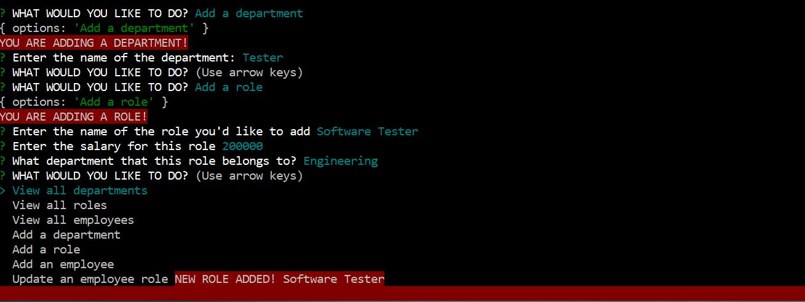

# Employee Tracker on Command

## Description
This application uses the command line to quickly generate data from from an employee tracking database. When prompted for choices to view specific data, the application accepts your input and displays the proper information. You are able to view all departments, employees, and roles; and ALSO add departments and roles including an option to update an employee's role.

## Table of Contents
- [Installation](#installation)
- [Usage](#usage)
- [Video](#video)
- [Screenshots](#Screenshots)
- [Credits](#credits)
- [Tests](#tests)
- [License](#license)

## Installation
Clone the repository: **git clone https://github.com/Firene11/employee-tracker-on-command.git**

Open the terminal and make sure you’re in the root directory.

## Usage
From the command line in your terminal run the commmand:

**node server.js**

Choose an option from the list to view specific information from the employee database. Once you view the data, you are immediately able to choose another option. 

## Video

**Watch this VIDEO to see how the app runs!**

[Link to Video](https://drive.google.com/file/d/14Oaowj3uehFyVMunK8R03o3p-Jemd3tI/view)

## Screenshots

 
 
 
 
 
 
 
 
 

## Credits
n/a

## Tests

n/a

## License
none

